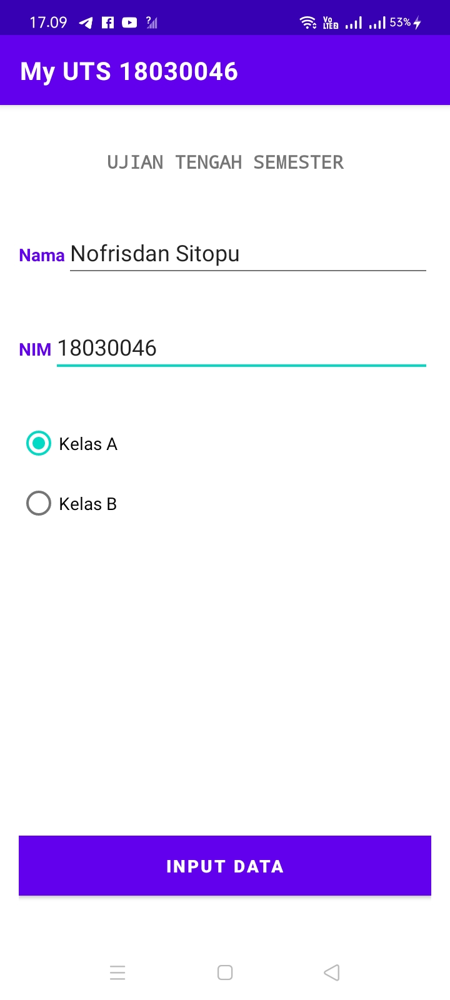
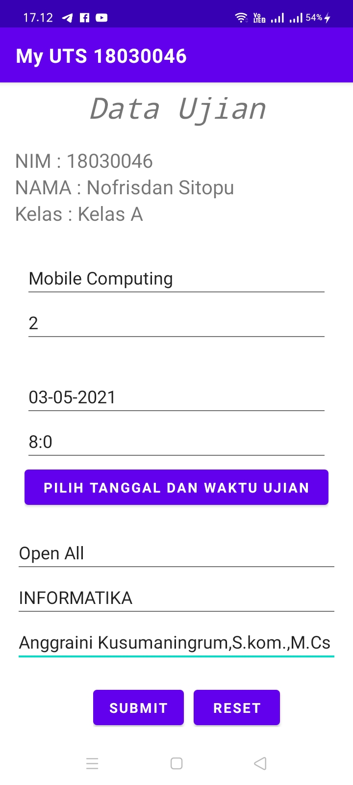
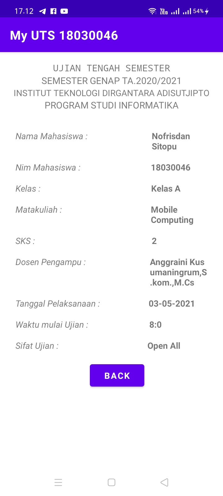
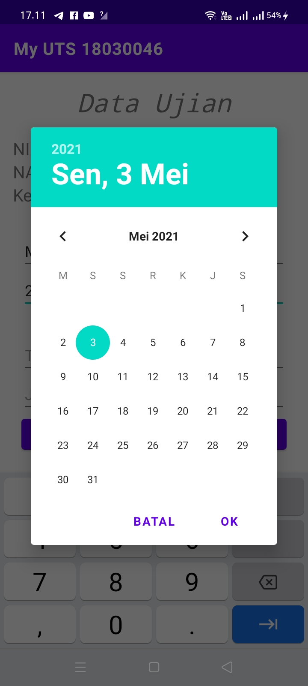
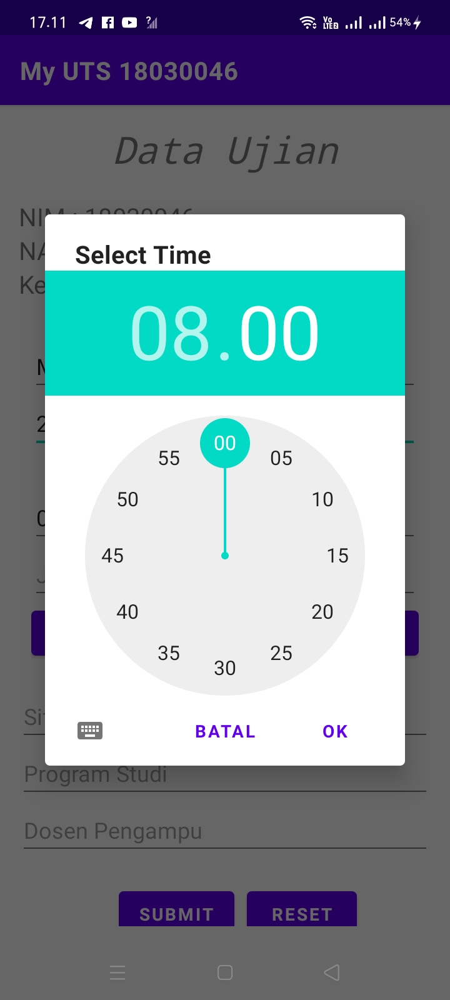

<h1 style="color:green">Dokumentasi Hasil UTS Mobile Computing</h1>

<strong>User Interface Hasil Aplikasi </strong>

Tampilan Utama Aplikasi 

 

Tampilan Kedua Aplikasi 

 

Tampilan Ketiga 

 

Atribut Yang ditambahkan 

<blockquote>1. Date Picker</blockquote>

 
<blockquote>2.Time Picker</blockquote>

 
<blockquote><stong>Cara Instalisasi Source Code </strong</blockquote>
  

  
  Cara 1. klik tombol code berwarna hijau di sebelah kanan atas, lalu klik dwonload ZIP, selanjutnya anda 
  extract file tersebut sebanyak 2 kali, karena default file dimasukkan berbentuk ZIP

  Cara 2. Jika di komputer anda sudah terinstal git silahkan copy source code dibawah ini dan jalankan 
  di terminal atau CMD anda 
  <blockquote>$ git clone git://github.com/Nofrisdan/UTS_MobileComputing_18030046</blockquote>
 

